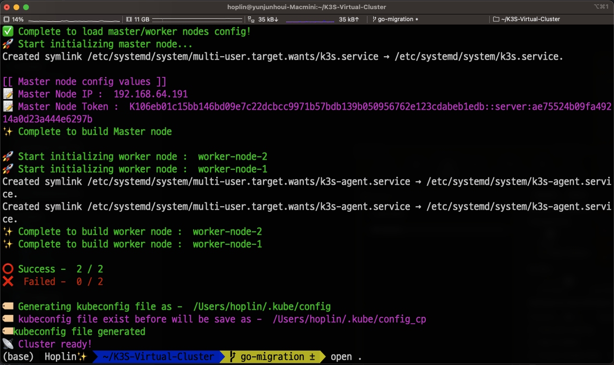

# Kubernetes Virtual Cluster Simulator

#### **Project's idea is inspired by [@Present Jay](https://github.com/PresentJay/lightweight-kubernetes-sandbox-cli)!**

---


**Virtual multi-node kubernetes cluster with Canoniacal Multipass!**

---

Version : 0.2.0

---
## What's new?

- The base language of this project has been changed to go language.
- There are more advantages than Python in CLI production, and open source called [cobra](https://github.com/spf13/cobra) was used for this project
- Apply the concept of concurrency programming using goroutine to show improved performance compared to Python version

I'll organize the details with the patch note ASAP

## Required Spec

**Standard under below is environment of 1 master & 2 worker node**

- OS : Linux / Mac OS X (**Windows not supported!**)
- CPU
  - Least : 4 Core CPUs
  - Stable : 8 Core CPUs or upper
- Memory
  - If your environment is 8GB of RAM : 1 master, 1 worker node is recommended
  - Least : 16 GB of RAM
  - Stable : 32 GB of RAM or upper
- Golang : **Upper than v 1.18**

---

## Pre-Requisite

- Install Multipass
  - https://multipass.run
- Install kubectl

  - https://kubernetes.io/docs/tasks/tools/

- Install helm
  - https://helm.sh/docs/intro/install/

**If more than one requisite is not satisfied, CLI will return error like underbelow**

---

## Before start

1. Clone repository

```
git clone https://github.com/J-hoplin1/K3S-Virtual-Cluster.git

cd K3S-Virtual-Cluster
```

2. Install required packages

```
go install
```

3. Compile

```
go build
```

Will going to provide a solution that is registered in the environmental variable and used in near future ☺️

3. Make your K3S Version of dotenv file. Default is `v1.26.6+k3s1`. Find available version [here](https://github.com/k3s-io/k3s/releases)

```
...

K3S_VERSION=v1.26.6+k3s1

...
```

---

## Commands

- Initialize cluster

  - **Due to lack of computing resources, master / worker node may not initialize properly sometimes. Please check computing resource before initiate cluster. (Usually occured in 8/16 GB RAM PC)**

  ```
  ./virtual-cluster cluster init
  ```

- Terminate cluster

  ```
  ./virtual-cluster cluster terminate
  ```

- Add new worker-node to cluster (Scale-Out)
  - `-n` option is required when using `-c add` option
  ```
  ./virtual-cluster cluster add -n <new-node-name>
  ```
- Connect to node instance's shell
  - `-n` option is required when using `-c shell` option
  ```
  ./virtual-cluster cluster shell -n <node-name>
  ```
- Delete worker-node from cluster
  - **Warning : This option ignore daemonsets and delete local datas of node!**
  - `-n` option is required when using `-c delete` option
  ```
  ./virtual-cluster cluster delete -n <node-name>
  ```

---

## How to use?

### Cluster Node Configuration

**You need to recognize that both master/worker node config data should be object type.**

**Only one master node is available.** Master node's configuration
is located in [nodes/master/config.json](./nodes/master/config.json), and should have key called `master-node`

```json
{
  "master-node": {
    "cpu": "2",
    "memory": "2048M",
    "disk": "20G",
    "ip": "",
    "token": ""
  }
}
```

**No limitation of worker node count.** You can add worker node in [nodes/worker/config.json](./nodes/worker/config.json). Add with following format

```
{
  ...,


    "worker-node-name": {
        "cpu": "(ex : 1)",
        "memory": "(ex : 2048M)",
        "disk": "(ex : 20G)",
    }

  ...,
}
```

key of config data becomes, node instance's name.

Please obey worker-node name based on this regular expression

```
^[A-Za-z0-9][A-Za-z0-9-]*$
```

Recommend to set at lease `1 cpu` and `2048M of RAM`, `15GB of disk` per node

### kubectl

When you initialize the cluster, the kubectl on the host pc is connected to the virtual cluster. The previous existing kubectl setting will be saved as `~/.kube/config_cp`.

Execute `kubectl get nodes` in host machine for check after initiate cluster!



### Scale out worker node

You initialize cluster. But let's say that you want to add new worker node in cluster. You don't need to terminate and re initialize cluster. Just add worker node information in [worker node config](./nodes/worker/config.json)

```
{
  ...,


    "scaled-out-cluster": {
        "cpu": "(ex : 1)",
        "memory": "(ex : 2048M)",
        "disk": "(ex : 20G)",
    }

  ...,
}
```

and use command under below

```
python3 cluster.py -c add -n <new-node-name>
```

---

